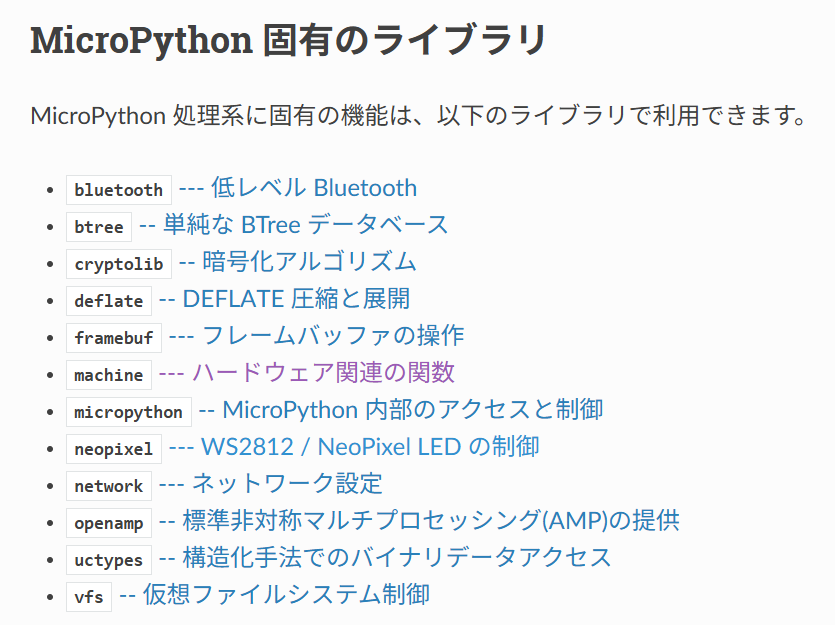
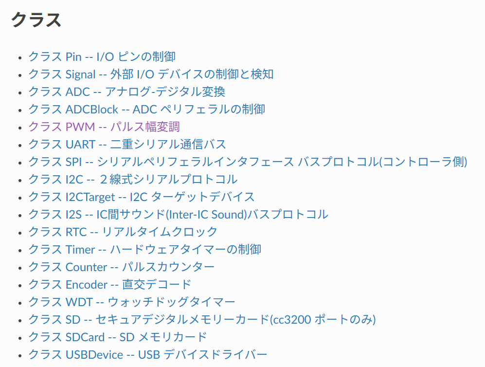

### MicroPython/Python復習 (すでにPythonを習った方を前提)
- MicroPython特有の注意点を説明　(https://micropython-docs-ja.readthedocs.io/ja/latest/rp2/quickref.html)
  - マイコン専用のモジュール、Pinの取り扱い等 
- MicroPythonはマイコンを使いこなすためにモジュールが追加されています。周辺I/Oを制御する場合、モジュールを使うことで可能になります
- 特に重要なのはmachineモジュールです。machineモジュール配下に、Serial/I2C/SPI用Classが提供されています
- I2CやSPIで接続される周辺機器を制御する場合、下記のクラスを使ってマイコンの周辺I/Oを制御します

 
 
https://micropython-docs-ja.readthedocs.io/ja/latest/library/index.html#micropython-lib-micropython 
https://micropython-docs-ja.readthedocs.io/ja/latest/library/machine.html#classes 

  - MicroPythonかCircuitPythonか？
    - CurcuitPythonはMicroPythonから派生した言語で、Adafruit社が開発メンテナンス
    - 基本的なPythonの仕様は同じだが提供されるモジュールが異なる。同等のモジュールでもメソッド（関数）の仕様が異なる
    - MicroPythonを基本に使い、使いたいセンサのドライバがCircuitPython版しかない場合、CircuitPythonを選択するのが良いのでは
    - CircuitPython版ドライバをMicroPython版にポーティングするのも可能（自力で頑張る） 

