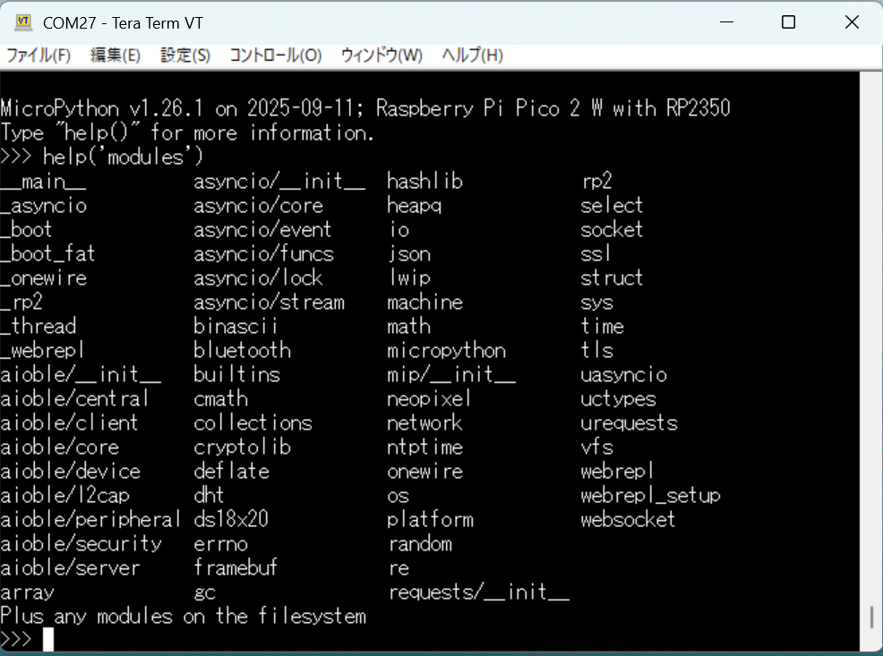
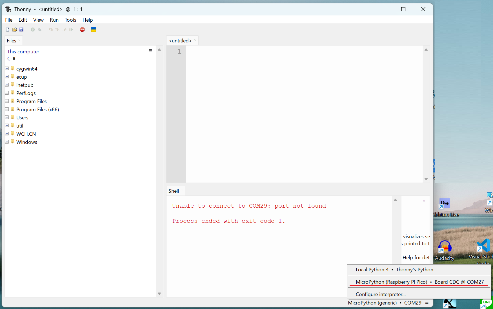

# プログラミングの方法

### ターミナルソフトの利用、IDEの利用
MicroPythonのプログラミング方法として、(1)REPLによる評価を中心とし、確定したコードをファイル化する、(2)統合開発環境(IDE)を用いてソースコード作成を中心に行うの2つの方法が考えられます。

(1)REPLによる評価を中心とするのは、新しいセンサを使ってみる、ドライバを試作するといった試行錯誤を行う場合に有効です。
(2)IDEによるソースコード開発は、規模の大きいソフトウエアを開発する場合に適しています。

(1)のREPL中心の操作としてよく使われるのはTera Term等のターミナルソフトです。Raspberry piの環境にupysh.pyを入れておけば、ファイル作成も可能になります。


(2)のソースコード試作中心の場合、よく使われるのはThonnyと思います。Thonnyは統合開発環境であり、コーディング以外にMicroPythonからの出力を表示し、さらに、グラフ化機能も実装されています。



### メンテナンスツール(CLI)
複数のファイルのバックアップや更新作業を行いたい時、IDE等で１ファイルずつバックアップ、更新を行うのは手間がかかります。このような場合、メンテナンスツールを使うと、作業が自動化できます。
MicroPython のリモート制御: mpremote<br>
https://micropython-docs-ja.readthedocs.io/ja/latest/reference/mpremote.html#micropython-remote-control-mpremote

### コマンド例

RP2のFlash上に実現されているファイルシステム内の/lib配下のファイルを一覧表示
```
$ python3 -m mpremote connect /dev/ttyS17  fs ls :/lib
ls :/lib
        3164 I2C_LCD.py
        6536 LCD_API.py
        1448 hc_sr04.py
           0 mfr522.py
       16758 mfrc522.py
        5250 mpu6050.py
         428 mylib.py
           0 neopixel.pyb
        3009 neopixel2.py
        9959 sdcard.py
        2824 upysh.py
```
```
   for file in  I2C_LCD.py LCD_API.py hc_sr04.py mfrc522.py mpu6050.py mylib.py neopixel2.py sdcard.py upysh.py 
do
  echo $file
  echo "python3 -m mpremote connect /dev/ttyS17  fs cp :/lib/$file  ./lib/$file"
  python3 -m mpremote connect /dev/ttyS17  fs cp :/lib/$file  ./lib/$file
done   
```
一括転送の例
```
python3 -m mpremote connect /dev/ttyS17  fs cp -r  ./lib  :/lib
```
