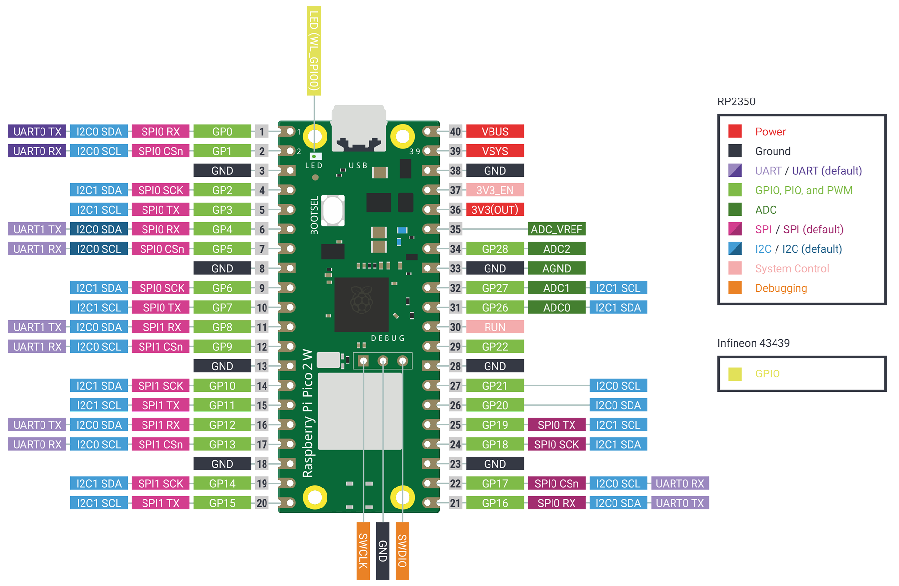
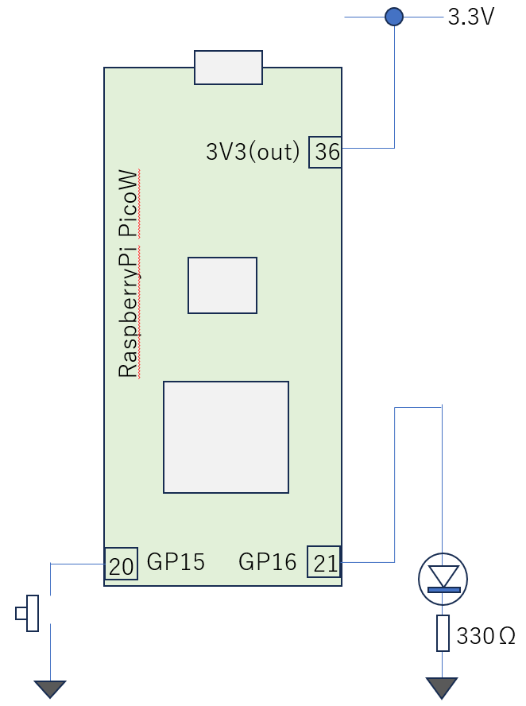

# LED 点滅プログラム
Raspberry Pi Pico 2 Wのピン配置は以下となっています。GPIO番号をよくご確認ください。
<br>

LEDはGP16に接続します。物理的なピン番号とGPIO番号を間違いやすいのでご注意くださ。LEDが点灯するかREPLで試しましょう

<br>

GP16を出力用に初期化するコードは以下
```
from machine import Pin
led = Pin(16, Pin.OUT)
```
点灯、消灯するプログラムは以下
```
led.on()
led.off()
```
押しボタンスイッチはGP15に接続します。
GP15を入力用に初期化するコードは以下。通常はスイッチをプルアップしておき、押されたらGNDに接続する回路を組むと思います。幸い、GPIOにはPullUp回路が内蔵されていますので、GPIO側でPullUpしておくことで、プルアップ抵抗の取付を省略できます。
```
from machine import Pin
sw = Pin(15, Pin.IN, Pin.PULL_UP)
```
押しボタンを押して値が0になるか確認しましょう
```
sw.value()
```

押されている時はLEDが点灯するプログラム（部分）は以下
スイッチの値を取得して、値が0であれがGNDに接続されている(押されている)と判断できます。
0の時は押されている時ですのでLEDを点灯させます。それ以外はLEDを消します。
```
while True:
    print(sw.value())
    if sw.value() == 0:
        led.on()
    else:
        led.off()
```
