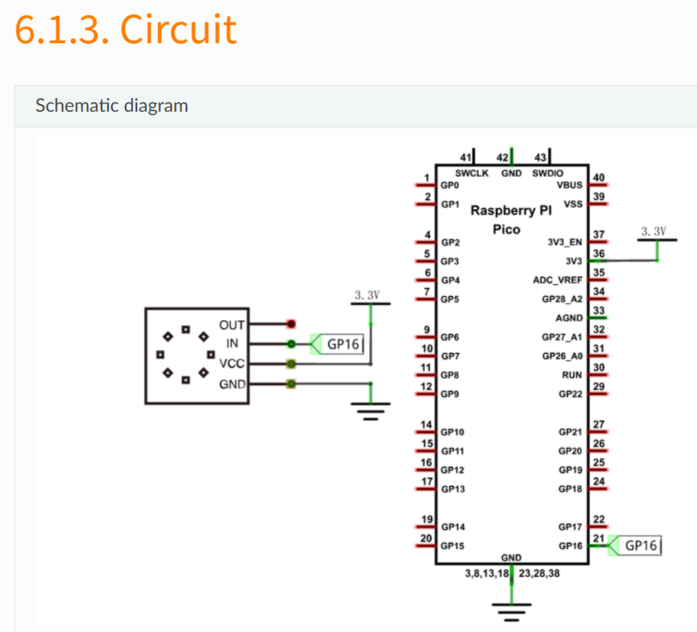

# NeoPixelの制御

NeoPixelはシリアルで制御できるカラーLEDであり、複数直列に接続可能です。（数珠繋ぎに何個でもつなげられる）。
組み込みライブラリのNeoPixelではタイミングが守れないためか正常に動作しません。freenoveが提供するNeoPixelドライバはPIOによりタイミング制御されており、誤動作なく正確に動作します。以下に置いていますので、このライブラリを使ってください。<br>
https://github.com/foobarbazfred/Pico-MicroPython-Workshop/blob/main/3-Day1-Foundation/src/lib/neopixel.py<br>
mipを使ってインストールすることもできます
```
import mip
mip.install('https://raw.githubusercontent.com/foobarbazfred/Pico-MicroPython-Workshop/refs/heads/main/3-Day1-Foundation/src/lib/neopixel.py')
```

結線についてはFreeNove様の図を流用しています<br>
<br>
FreeNove様の説明ページ<br>
https://docs.freenove.com/projects/fnk0058/en/latest/fnk0058/codes/Python/6_NeoPixel.html<br>
組み込みモジュールとしてすでに導入されているneopixelとの衝突を避けるため、neopixel2.py等と名前を変えてMicroPythonにインストールしてください。<br>
upyshを使った場合以下でリネームできます
```
from upysh import *
mv('/lib/neopixel.py', '/lib/neopixel2.py')
```
上記ライブラリが正しく使えているかは以下で確認してください。
```
>>> import neopixel2
>>> dir(neopixel2)
['__class__', '__name__', 'Pin', '__dict__', '__file__', 'array', 'rp2', 'time', 'ws2812', 'myNeopixel']
```
dir(neopixel2)と入力すると、neopixel2モジュール内のシンボル一覧が表示されます。myNeopixelが含まれているとPIOを用いたfreenove版がロードされています。
LED数が8のNeoPixelを初期化するプログラムは以下
```
import time
from machine import Pin
from neopixel2 import myNeopixel
NUM_LEDS = 8
PIN_NO = 16
np = myNeopixel(NUM_LEDS, PIN_NO)
```
5番目のLEDを点灯させるプログラム（色は青緑）
```
pos = 5
led_r = 10
led_g = 100
led_b = 100
np.set_pixel(pos, led_r, led_g, led_b)
np.show()
```
消灯は以下です
```
np.fill(0,0,0)
np.show()
```
NeoPixelを使ってR/G/Bの色合いで中間値を表現したり、LEDの点灯位置でアナログ的に表現することが可能です。

LEDがぐるぐる回るサンプルは以下です(０の位置が消えないバグが残っています)
```
import time
from machine import Pin
from neopixel2 import myNeopixel
NUM_LEDS = 8
PIN_NO = 16
np = myNeopixel(NUM_LEDS, PIN_NO)

led_r = 10
led_g = 100
led_b = 100

prev_pos = None
while True:
   for pos in range(NUM_LEDS):
       if prev_pos:
           np.set_pixel(prev_pos, 0,0,0)
       np.set_pixel(pos, led_r, led_g, led_b)
       np.show()
       prev_pos = pos
       time.sleep(0.05)
```
