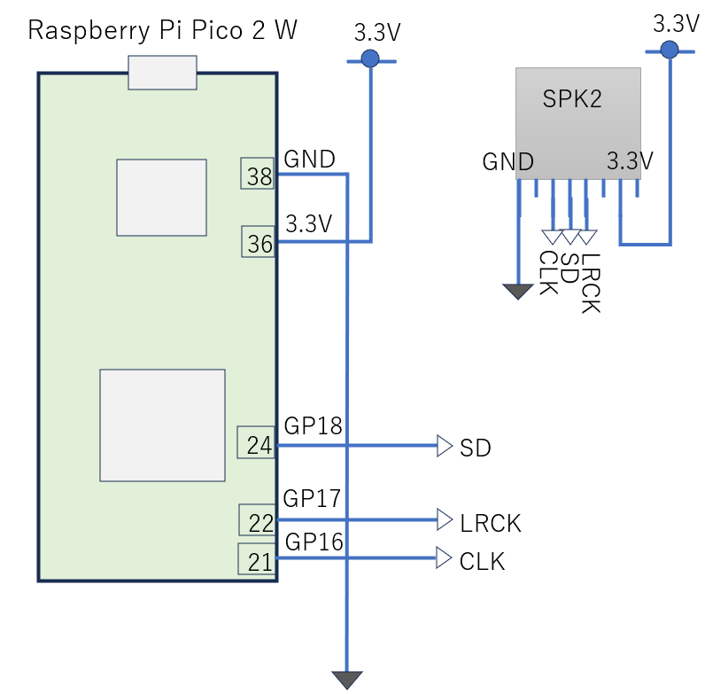

# I2SによるDAコンバータとの接続

非圧縮の音データを送受信するための仕様として、I2S (Inter-IC Sound)があります。これはNXPにより策定された仕様であり、下記の信号線で音データが送信されます。I2Sは、DigitalMICやADC（Analog to Digital Converter）とマイコンの接続、マイコンとDAC（Digital to Analog Converter）との接続で使われます。
- 16bit/24bit長の音データ : SD (SDATA)
- L/Rのいずれであるかを示すCLK: WS (LRCLK/WDCLK)
- 1bitの音信号を示すCLK:  SCK (SCLK)
- MasterClock (SYSCLK/MCLK)

https://en.wikipedia.org/wiki/I2S<br>
I2Sを用いてデバイスと接続する場合、I2Sで規定される信号線の仕様に加え、IS2上で送受信するデータの表現形式（データ仕様）を考慮する必要があります。I2Sを用いて送受信するデータ仕様は、DAC等のデバイスによって決まります。
開発キットに含まれるDACは、BarBrown社製のPCM5100Aという製品でありデータ仕様は以下です

|パラメータ|指定可能な値|
|--|--|
|サンプリングレート |8 kHz to 384 kHz |
|1音のbit幅 |16bits,24bit,32bit |
|システムクロック|Clock multiples: 64, 128, 192, 256, 384, 512, 768, 1024, 1152, 1536, 2048, or 3072|

なお、PCM5100Aの場合、システムクロックが供給されない場合、SCLから自動生成されます



```
#
# Sample Source for BB PCM5100A DAC
#
#

import os
import time
import math
import array
from machine import Pin
from machine import I2S

SCK_PIN = 16   # Serial Clock
WS_PIN = 17    # L/R Clock
SD_PIN = 18    # Serial Data

I2S_ID = 0
BUFFER_LENGTH_IN_BYTES = 1024

SAMPLE_RATE_IN_HZ = 8_000      # The lowest supported sample rate of PCM5100A (8KHz)
SAMPLE_SIZE_IN_BITS = 16       # 16bits/sound
FORMAT = I2S.MONO              # 

# frequence define
FREQ_C4 = 262
FREQ_D4 = 294
FREQ_E4 = 330
FREQ_F4 = 349
FREQ_G4 = 393
FREQ_A4 = 440
FREQ_B4 = 494
FREQ_C5 = 523


#
MAX_VOLUME = 0xff


#
# setup I2S
#
audio_out = I2S(I2S_ID, sck = Pin(SCK_PIN), ws = Pin(WS_PIN), sd = Pin(SD_PIN),
          mode = I2S.TX, bits = SAMPLE_SIZE_IN_BITS, format = FORMAT, rate = SAMPLE_RATE_IN_HZ,
          ibuf = BUFFER_LENGTH_IN_BYTES,
)


#
# create a buffer containing the pure tone samples
#


#
# make wave table for 1 pulse (specificed frequency)
#
def make_tone_signed_16b(sample_rate, frequency, volume = MAX_VOLUME):
    samples_per_cycle = sample_rate // frequency
    samples = array.array('h', [0] * samples_per_cycle)  # 'h' : signed short (2bytes)
    # value_range : max value of posivtive value  ; -tone_value_range -- 0 -- +tone_value_range
    if volume == MAX_VOLUME:
        tone_value_range = (pow(2, (SAMPLE_SIZE_IN_BITS - 1)) - 1)
    else:
        tone_value_range = (pow(2, (SAMPLE_SIZE_IN_BITS - 1)) - 1) * volume // MAX_VOLUME
    #print('tone_value_range', tone_value_range)
    for i in range(samples_per_cycle):
        samples[i] = int(tone_value_range * math.sin(2 * math.pi * i / samples_per_cycle))
    return samples


def sound_test_play_CEG():

    tone_C4 = make_tone_signed_16b(SAMPLE_RATE_IN_HZ, FREQ_C4)
    tone_E4 = make_tone_signed_16b(SAMPLE_RATE_IN_HZ, FREQ_E4)
    tone_G4 = make_tone_signed_16b(SAMPLE_RATE_IN_HZ, FREQ_G4)
    tone_C5 = make_tone_signed_16b(SAMPLE_RATE_IN_HZ, FREQ_C5)

    for _ in range(3):
        # play C4
        for _ in range(int(FREQ_C4 / 8)):    # play for 0.125sec
            _ = audio_out.write(tone_C4)
        
        # play E4
        for _ in range(int(FREQ_E4 / 8)):   # play for  0.125sec
            _ = audio_out.write(tone_E4)
        
        # play G4
        for _ in range(int(FREQ_G4 / 8)):    # play for 0.125sec
            _ = audio_out.write(tone_G4)
       
        time.sleep(0.25)  # no sound for 0.5

    # play C5
    for _ in range(int(FREQ_C5/3)):    # play for 0.3sec
        _ = audio_out.write(tone_C5)


def sound_test_volume_change():
    freq = FREQ_A4
    for volume in range(0x00, MAX_VOLUME, 0x10):
        tone_data = make_tone_signed_16b(SAMPLE_RATE_IN_HZ, freq, volume)
        print(f'vol: {volume:02x}')
        print(tone_data)
        for _ in range(freq*2):   # play for 2sec (play 440 * 2 times (440Hz wave))
            _ = audio_out.write(tone_data)
        time.sleep(0.1)

    # max volume
    print(f'vol: {MAX_VOLUME:02x}')
    tone_data = make_tone_signed_16b(SAMPLE_RATE_IN_HZ, freq)
    print(tone_data)
    for _ in range(freq*2):   # play for 2sec (play 440 * 2 times (440Hz wave))
        _ = audio_out.write(tone_data)
    


print('sound play test  C->E->G->C')
sound_test_play_CEG()

print('volume test')
sound_test_volume_change()

#
#machine.reset()
#

#
# end of file
#
```

https://github.com/foobarbazfred/Pico-MicroPython-Workshop/blob/main/3-Day1-Foundation/src/lib/I2S_sample4.py<br>
https://micropython-docs-ja.readthedocs.io/ja/latest/library/machine.I2S.html<br>
https://micropython-docs-ja.readthedocs.io/ja/latest/rp2/quickref.html#i2s-bus<br>
https://github.com/micropython/micropython/blob/master/ports/rp2/machine_i2s.c<br>
https://www.nxp.com/docs/en/user-manual/UM11732.pdf<br>

https://www.ti.com/lit/ds/symlink/pcm5100a-q1.pdf<br>
https://docs.freenove.com/projects/fnk0058/en/latest/fnk0058/codes/C/29_Play_Music.html<br>
