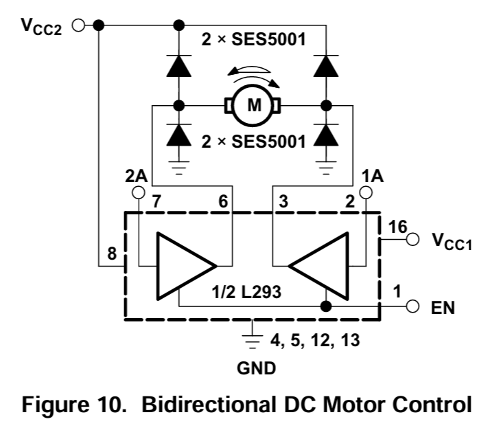
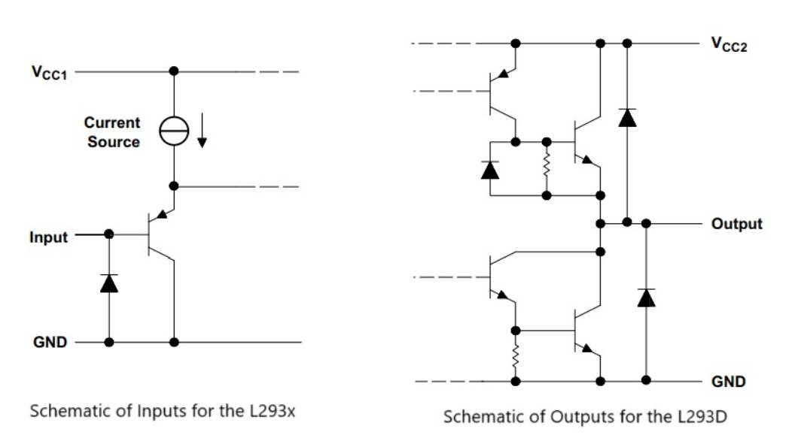
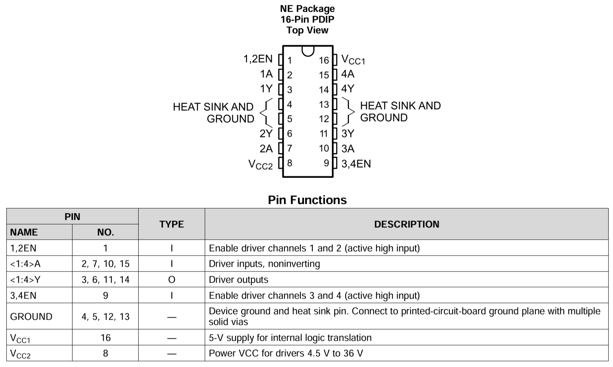
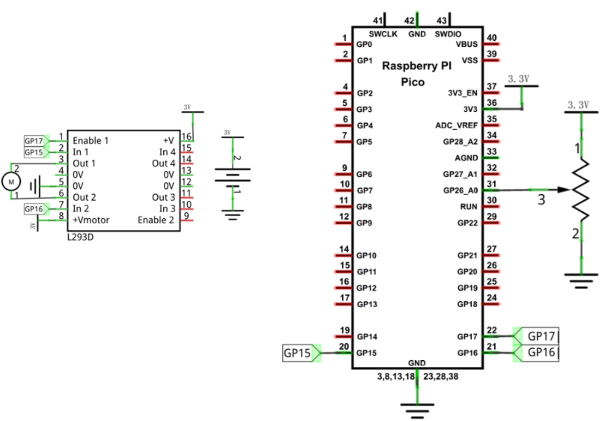

# PWMによるモータ制御

PWMを使ってモータの回転速度を制御できます。マイコンの出力端子をモータに直結すると電流が流れすぎてマイコンが壊れるので、マイコンとモータの間に電力制御用のドライバ（ゲート回路）を挟みます。
モータ制御用のドライバとして、マイコン制御用モータドライバICには、L293D、L298N、TB6612FNG、DRV8833などがあります。(以下は生成AIから転記)

- L293D（Texas Instruments）
  - 古典的なHブリッジIC。
  - DCモータやステッピングモータを制御可能。
  - 最大電流は600mA程度。
  - 内蔵フライバックダイオードで逆起電力から保護。
  - 教育用ロボットやArduino教材で定番。
- L298N（STMicroelectronics）
  - L293Dの強化版。
  - 2A程度まで駆動可能。
  - 大きめのモータやロボットカーに利用される。
- TB6612FNG（東芝）
  - 小型・高効率なHブリッジドライバ。
  - 1.2A程度まで対応。
  - ArduinoやRaspberry Piのロボット教材で人気。
  - L293Dより発熱が少なく、より実用的。
- DRV8833（Texas Instruments）
  - 低電圧・低消費電力向け。
  - 2つのDCモータまたは1つのステッピングモータを制御可能。
  - 1.5A程度まで対応。
  - 小型ロボットやバッテリー駆動機器に適している。

### L293Dについて
 
 
 

Freenoveのテキストから引用(3VでL293Dはまずいので、5Vで駆動すべき) 

### 参考資料
L293D仕様書 
https://www.ti.com/jp/lit/ds/symlink/l293d.pdf 
Freenoveのテキスト 
https://docs.freenove.com/projects/fnk0058/en/latest/fnk0058/codes/Python/18_L293D_%26_Motor.html 
L293Dの説明 WebPage 
https://www.ic-components.jp/blog/L293D-Motor-Driver-IC-Detailed-Pinout,Specs-Datasheet.jsp 
Hブリッジ回路 
https://techweb.rohm.co.jp/product/motor/motor-types/260/
