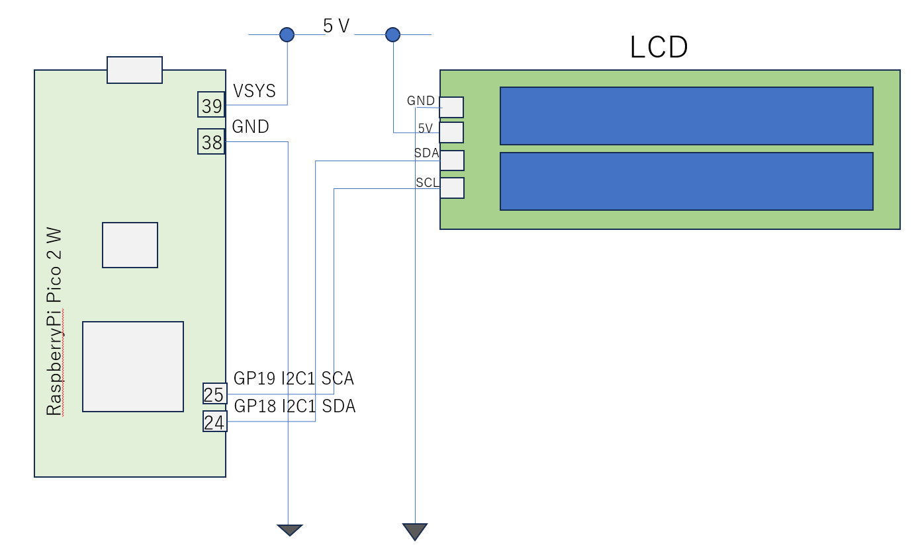

# LCD Displayの利用

LCD Display（LCDキャラクターディスプレイモジュール(16×2行バックライト付)）は16x2が表示可能です。LCDとはI2Cで接続され、I2Cのデバイスアドレスは0x27です。
マイコンとの接続は、5V,GNDに加え、I2Cのクロック、データバスを接続します。
I2Cと8bitバスの変換にはコントローラはPCF8574T (PCF8574AT)が使われています。LCDコントローラは一般的なコントローラである、HD44780互換品やST7066等と思われます。


### LCDの接続
LCDを以下で接続してください。(I2C(0)のデフォルトPIN配置）
```
 scl=5, sda=4,
```

先ほど説明に従い、HW I2Cを使いI2C_0でデフォルトで接続してみます。
```
from machine import Pin, I2C
i2c_1 = I2C(1, scl=Pin(19), sda=Pin(18), freq=400_000)
```
正しく接続できているか、scan関数で確認します
```
i2c_1.scan()
```
以下が実行結果です
```
>>> from machine import Pin, I2C
>>> i2c_0 = I2C(0)
>>> i2c_0.scan()
[39]
>>> hex(i2c_0.scan()[0])
'0x27'
```
IOとしてどのPinを使用するか指定せず、デフォルトにまかせていました。設定内容を確認することもできます
```
>>> i2c_0
I2C(0, freq=400000, scl=5, sda=4, timeout=50000)
```
上記結果より、SCK:GPIO5、SDA:PGIO4, I2Cバスのクロック50KHz (50_000)であることが分かります。
LCDに文字を表示するには、RAM領域にASCIIコードを書き込む必要があります。プログラムですべて実装するのは大変なので、LCD用ドライバを活用して、プログラム量を減らせられます。
LCD用ドライバとして＃＃＃、＃＃＃、＃＃＃がありますが、今回使っているキットのメーカが提供するLCDドライバ(I2C_LCD1602)を活用します。

MIPを使えばGitHub上のソースを直接MicroPythonにインストールすることができます。
```
import mip
mip.install('https://raw.githubusercontent.com/Freenove/Freenove_Ultimate_Starter_Kit_for_Raspberry_Pi_Pico/refs/heads/master/Python/Python_Libraries/LCD_API.py')
mip.install('https://raw.githubusercontent.com/Freenove/Freenove_Ultimate_Starter_Kit_for_Raspberry_Pi_Pico/refs/heads/master/Python/Python_Libraries/I2C_LCD.py')
```
上記URLはLCD DriverのRAWファイルが取得できるURLです。


### LCDの初期化
```
from machine import I2C
from I2C_LCD import I2CLcd
LCD_ADDR = 0x27

i2c = I2C(0)
lcd = I2CLcd(i2c, LCD_ADDR, 2, 16)
```
テスト；文字列のPrint
```
lcd.clear()
lcd.move_to(0, 0)   # clearすると0,0に設定されます
lcd.putstr("# Hello, World! ")
```
文字列の途中に改行コードが含まれると２行目に改行されて出力されます
```
lcd.clear()
lcd.move_to(0, 0)   # clearすると0,0に設定されます
lcd.putstr(" ### Hello and \n  good bye ####")
```
2行目だけ出力したい場合は以下
```
lcd.clear()
lcd.move_to(0, 1)
lcd.putstr("     bye!! ")
```
今後他のデバイスがI2C_0を使うことを想定して、LCDはLCD_1を使います<br>



```
from machine import Pin
from machine import I2C
from I2C_LCD import I2CLcd
LCD_ADDR = 0x27

i2c_1 = I2C(1, scl=Pin(19), sda=Pin(18), freq=400_000)
lcd = I2CLcd(i2c_1, LCD_ADDR, 2, 16)
lcd.putstr('hello')
```

The serial-to-parallel IC chip used in this module is PCF8574T (PCF8574AT), and its default I2C address is 0x27(0x3F).

- FreeNoveから提供されるLCD用ドライバ
  - https://github.com/Freenove/Freenove_Ultimate_Starter_Kit_for_Raspberry_Pi_Pico/blob/master/Python/Python_Libraries/LCD_API.py
  - https://github.com/Freenove/Freenove_Ultimate_Starter_Kit_for_Raspberry_Pi_Pico/blob/master/Python/Python_Libraries/I2C_LCD.py
- 参考資料
  - https://cdn.sparkfun.com/assets/2/7/5/5/f/st7066.pdf
