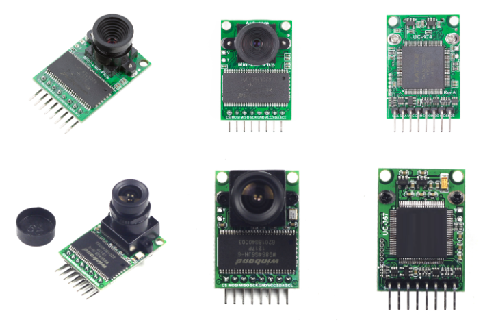

# CMOSカメラの利用
マイコンとCMOSカメラを接続することで、画像を取り扱うことが可能です。マイコンと接続可能なカメラとして、＃＃、＃、＃＃が挙げられます。
マイコンでカメラを扱う上での課題として、カメラからの画像データの取り込み方法です。カメラとの接続IFとして一般的にはUSBやパラレルがありますが、RP2+MicroPythonの組み合わせでは性能が間に合わずまともな画像取り込みは難しい問題があります。性能が不足して一般的な方法では画像取り込みが難しいマイコンにとって制御しやすいカメラとしてArducamが挙げられます。
Arducamの特徴は以下です。
- 画像用フレームバッファを内蔵
  - 撮影した画像が一旦フレームバッファに格納されます。マイコンからはフレームバッファのデータを読み込みます。 
- SPI接続で画像を高速に取り込める
  - フレームバッファを高速に読み込めるようSPI接続を行えるようになっています 
- RAWモード/JPEGモードの両方に対応
  - 画像をクラウドに転送する場合はJPEGフォーマットが適していますが、マイコン側で画像処理する場合は非圧縮のRAWモードが必要です。両方のフォーマットで撮影できます 
- 低解像度に対応
  - マイコンで画像処理する上で処理時間に応じた解像度に切り替える必要があります。アタリを付ける前処理等では低解像度で行う場合があり、低解像度モードがあるとより使いやすくなります 

Arducam Shield Miniの外観<br>
<br>
画像は、Arducam Wikiより引用(https://docs.arducam.com/Arduino-SPI-camera/Legacy-SPI-camera/Camera-Models/)<br>
カメラの性能により、2メガピクセル版(上段)と5メガピクセル版(下段)があります。5メガピクセル版のイメージセンサはOV5642が使われています。

### カメラとの接続
マイコンとカメラとの接続はSPIとI2Cの両方を使います。撮影時の画素やフォーマット等、カメラ制御はI2Cで行います。撮影された画像データはフレームバッファに格納されます。マイコンへの画像データ転送はSPIで行います。

### Arducam (OV5642 5MPixel)の制御
Arducamは　OV5652によるセンサ部と、フレームバッファ部で構成されます。OV5642の制御はI2Cで行い、フレームバッファの制御はSPIで行います。画質や画像サイズの設定、ホワイトバランスの設定等、撮影に関する設定はすべてOV5642に対して行います。どのようなレジスタ構成になっているか？はArducamの仕様書には掲載されておらず、OV5642の仕様書を参照する必要があります。非常に多くのレジスタが存在しており、間違った値を設定すると正しく撮影できない問題が発生します。このため、仕様書を調べながら個々の設定を決定するのではなく、サンプルコードをそのまま流用しています(MicroPytyon用Arducamドライバが存在するかもしれません。今回はOV5642を理解するため自分でドライバを作りたいと思い、MicroPython版ドライバの有無を調べていません)。<br>
画像データはOV5642から取得せず、一旦フレームバッファに格納されます。フレームバッファが搭載されているおかげで、撮影速度とデータ取得速度が一致してなくても画像データの取りこぼしが発生せず、欠損のない画像が取得できます。OV5642からフレームバッファへの取り込み指示は、フレームバッファ用レジスタにフラグを立てることで指示します。具体的には、FIFO control Register(0x04番地)のBit[1]に１を設定することでフレームバッファへの画像取り込みが行われます。

Arducam用ドライバを試作して以下に公開しています。
- [ov5642用ドライバ](src/lib/ov5642.py)
- [ov5642 FIFO制御プログラム](src/lib/ov5642_FIFO.py)  (上記ov5642.pyから呼ばれます)
- [ov5642 初期設定パラメータ](src/lib/ov5642_setup.py)  (上記ov5642.pyから呼ばれます)

OV5652用ドライバ一式のインストール方法
```
import mip
PATH = 'https://raw.githubusercontent.com/foobarbazfred/Pico-MicroPython-Workshop/refs/heads/main/3-Day1-Foundation/src/lib/'
for file in ('ov5642.py', 'ov5642_setup.py', 'ov5642_FIFO.py'):
    mip.install(PATH + file)
```

### Arducam (OV5642 5MPixel)のサンプルコード
以下にArducamを使った撮影の例を示します。
```
from machine import Pin
from machine import I2C
from machine import SPI
from ov5642 import OV5642

ov5642i2c = I2C(scl=Pin(5), sda=Pin(4), freq=9600)

CAM_PIN_CS = 1
fifo_cs = Pin(CAM_PIN_CS, Pin.OUT)

SPI0_BAUDRATE=10_00_000
SPI0_MOSI = 3
SPI0_MISO = 0
SPI0_SCK = 2
fifo_spi = SPI(0,SPI0_BAUDRATE,sck=Pin(SPI0_SCK), mosi=Pin(SPI0_MOSI), miso=Pin(SPI0_MISO))
ardu = OV5642(ov5642i2c, fifo_spi, fifo_cs)

SCREEN_WIDTH=160
SCREEN_HEIGHT=128
BYTEPERPIX=2  # RGB565

import gc
gc.collect()
buf = bytearray(SCREEN_WIDTH * SCREEN_HEIGHT * 2)

ardu.fifo.clear_done_flag()       
ardu.fifo.start_capture_and_wait()
ardu.read_pixels(buf)
```
上記操作により、160x128画素、RGB565形式の画像がbufに取り込まれます。現在ドライバの作り込みが不十分なため、高画素のJPEGイメージ等は撮影できません。
ドライバを作り込めば可能です（サンプルコードを読み解いて、どのレジスタに設定すればよいかが分かれば追加開発可能です）
非圧縮の画像であるため、MicroPythonでエッジ検出や二値化への変換に利用できます。

撮影した画像をグラフィックディスプレイに表示するコードは以下です。（ソースが長くなるのでグラフィックディスプレイの初期化は省略しています）
```
from machine import Pin
from machine import I2C
from machine import SPI
from ov5642 import OV5642

ov5642i2c = I2C(scl=Pin(5), sda=Pin(4), freq=9600)
CAM_PIN_CS = 1
fifo_cs = Pin(CAM_PIN_CS, Pin.OUT)

SPI0_BAUDRATE=10_00_000
SPI0_MOSI = 3
SPI0_MISO = 0
SPI0_SCK = 2
fifo_spi = SPI(0,SPI0_BAUDRATE,sck=Pin(SPI0_SCK), mosi=Pin(SPI0_MOSI), miso=Pin(SPI0_MISO))

ardu = OV5642(ov5642i2c, fifo_spi, fifo_cs)

SCREEN_WIDTH=160
SCREEN_HEIGHT=128
BYTEPERPIX=2  # RGB565

tft.rotate(1)   # rotate screen 90 degrees

import gc
gc.collect()
buf = bytearray(SCREEN_WIDTH * SCREEN_HEIGHT * 2)
def show_image():
    global buf
    ardu.read_pixels(buf)
    tft._set_window(0, 0, SCREEN_WIDTH - 1, SCREEN_WIDTH - 1)
    tft.data(buf)

while True:
   ardu.fifo.clear_done_flag()       
   ardu.fifo.start_capture_and_wait()
   show_image()
```


### ドキュメント類
- https://docs.arducam.com/Arduino-SPI-camera/Legacy-SPI-camera/Camera-Models/
- Arducam-Shield-Mini-5MP-Plus
  - https://docs.arducam.com/Arduino-SPI-camera/Legacy-SPI-camera/Hardware/Arducam-Shield-Mini-5MP-Plus/
  - サンプルコード：https://github.com/ArduCAM/Arduino/blob/master/ArduCAM/ArduCAM.cpp

画質をさらに上げるには、細かいパラメータ調整が必要です。より＃＃＃くカメラを制御するには、イメージセンサ(OV5642)の仕様書を参照してレジスタの設定方法を調べる必要があります<br>
5MP image sensor OV5642<br>
仕様書は一般公開されておらず、Confidentialの扱いの仕様書が出回っています。入手可能な仕様書へのリンクを直接貼るのは控えます。以下のキーワードで検索してみてください。<br>
`OmniVision product specification datasheet OV5642`<br>
Arduino用のサンプルコード一式がGitHub上で公開されていますので、ソースコードを読み解くとレジスタの使い方が分かると思われます。

