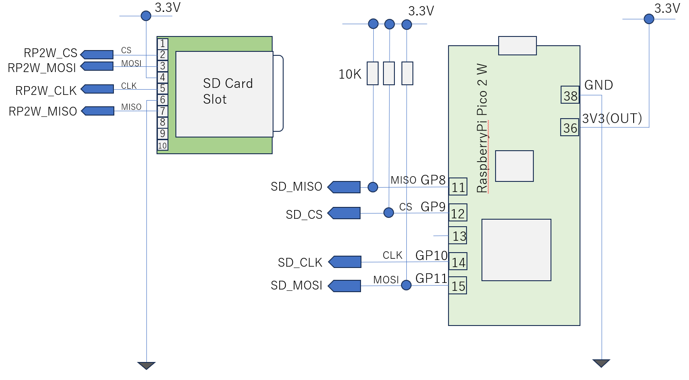

# SDカードの接続

SPIを用いてSDカードと接続することができます。SDカードには＃＃＃モードと、SPIモードがあり、SDカードの動作モードをSPIモードに切り替えて接続します。SDカードとのやり取りはSDカード用ドライバが提供されており、SDカード用ドライバを用いることで、数行のコードを書くだけでSDカードが利用可能になります。

SDカードを利用する上で、注意点があります。MicroPythonのファイルシステムでは、扱えるメディアのフォーマットがFAT12、FAT16、FAT32のいずれかである必要があります。exFATは扱えないので、exFATでフォーマットされたSDカードは読めません。６４GB以上の容量になるとexFATによるフォーマットが一般的ですので、６４GB以上のSDカードを読み書きする場合、ツールを使ってSDカードのフォーマットをFAT32でフォーマットしなおす必要があります。

今回の試作では、2つあるハードウエアSPIのうち、 Channel 1 を使っています。Channel 1のデフォルトピンアサインは、CLK:#, MOSI:#, MISO:# です。指定しなくても、SPI初期化時、SPI(1)とすると上記ピンが割り当てられますが、確実にピンが割り当てられるよう冗長ですが明示しています。

### 配線図


SDカード接続テスト
```
import os
from machine import Pin
from machine import SPI
import sdcard

SPI_MISO = 8
SD_CARD_CS = 9
SPI_SCK = 10
SPI_MOSI = 11
SPI_BAUD = 1_000_000  # 1MHz
#
# setup
#
cs = machine.Pin(SD_CARD_CS, Pin.OUT, pull=Pin.PULL_UP)
spi1 = SPI(1, baudrate=SPI_BAUD, sck=Pin(SPI_SCK), mosi=Pin(SPI_MOSI), miso=Pin(SPI_MISO))

# init SDCard Driver
sd = sdcard.SDCard(spi=spi1, cs=cs)

# mount SD Card Volume to /sd
os.mount(sd, '/sd')
os.listdir('/sd')

# umount SD Card Volume
#os.umount('/sd')
```

上記操作により、SDカードが/sdディレクトリにマウントされましたので、PCと同様に以下のコードでファイルの読み書きが可能になります。
```
import json

with open('/sd/config.json','r') as f:
   config = json.loads(f)
print(config)
```

### FAT32フォーマット

FAT32にフォーマットするには、Rufusフォーマッタというツールを使うのが楽と思います。

### 参考資料
- MicroPython 標準マニュアル SD-Cardの章(RP2用MicroPythonにはこの章のSD-Cardドライバは同梱されていません)
  - https://micropython-docs-ja.readthedocs.io/ja/latest/library/machine.SDCard.html#class-sdcard-secure-digital-memory-card
- MicroPython 標準マニュアル RP2 ハードウエアSPI
  - https://micropython-docs-ja.readthedocs.io/ja/latest/rp2/quickref.html#hardware-spi-bus
- SD Card SPIモード
  - https://github.com/Sensirion/python-i2c-scd/tree/master/sensirion_i2c_scd/scd4x

### SD Card Driver
https://github.com/micropython/micropython-lib/blob/master/micropython/drivers/storage/sdcard/sdcard.py
