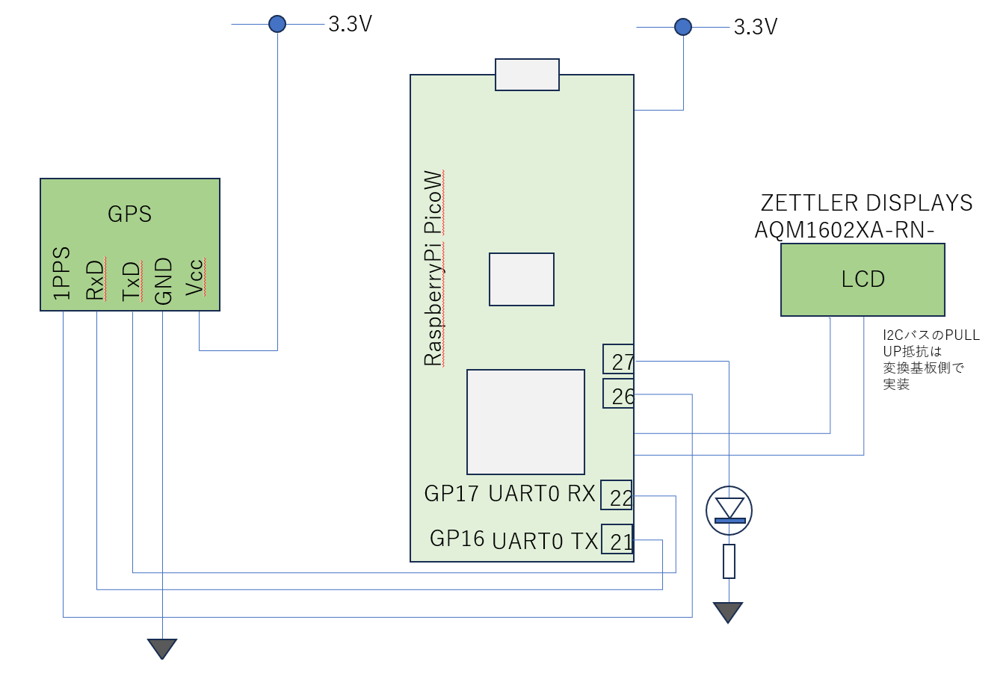

# GPSの利用

GPSを用いることで、正確な位置情報や時刻の取得が可能になります。入手が容易なGPSはSerial接続が多いです。秋月からはSerial接続可能なGPSが販売されています。ソフトウエアで細かい制御をせずともGPSは電源投入すると自動的に衛星をキャッチして時刻同期を行います。制御用コマンドが提供されており、出力情報の選択、Serial転送レートの変更、＃＃＃等を設定できます。

GPSの仕様
- Senserion SCD41
- 温度、湿度、CO2濃度
- I2C接続
   - デバイスアドレス： 0x62
   - メモリに割り当てられたレジストをRWするのではなく、センサに制御コマンドを送信して制御する

### 配線図

ソース一式

### 参考資料
- Serial
  - https://sensirion.com/jp/products/catalog/SCD41
- GPS Specification
  - https://sensirion.com/media/documents/48C4B7FB/67FE0194/CD_DS_SCD4x_Datasheet_D1.pdf

