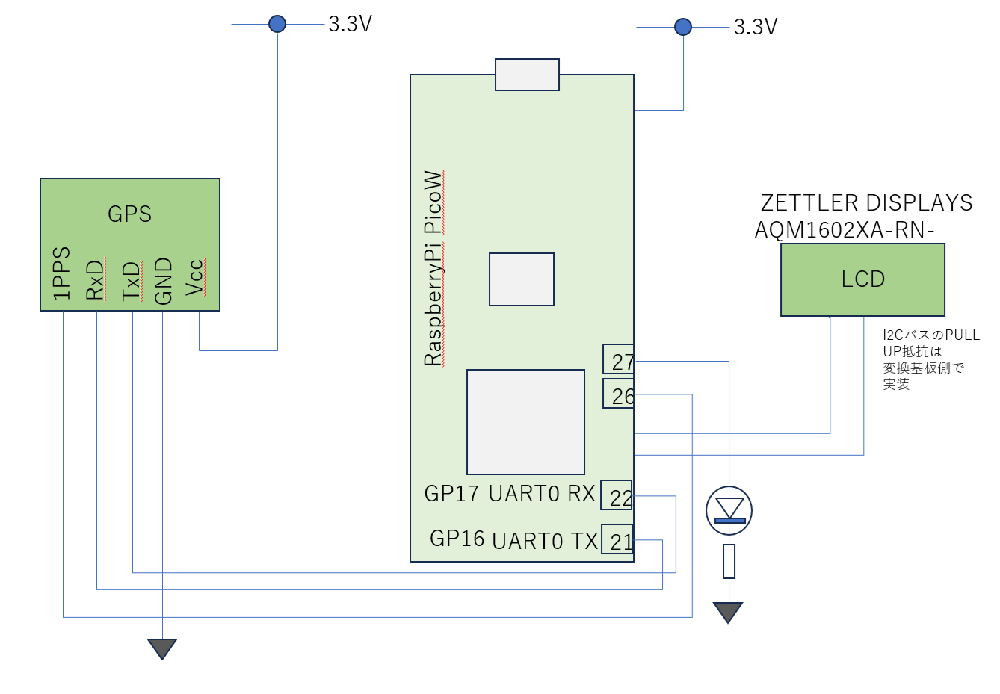

# GPSの利用

GPSを用いることで、正確な位置情報や時刻の取得が可能になります。入手が容易なGPSはUART接続が多いです。秋月からはUART接続可能なGPSが販売されています。ソフトウエアで細かい制御をせずともGPSは電源投入すると自動的に衛星からの電波を受信して時刻同期を行います。制御用コマンドが提供されており、出力情報の選択、UART転送レートの変更等がコマンドで制御できます。

GPSの仕様
- 製品名：GT-502MGG-N
- みちびき2機(194/195)対応
- UART接続
  - 9600bps(RX,TX)
  - 1秒単位の同期信号付き
### 配線図

ソース一式
[gps_gt-502.py](src/gps_gt-502.py)

### 参考資料
- 秋月GPSページ
  - https://akizukidenshi.com/catalog/c/csatellit/
- GPS(GT-502MGG) Specification
  - https://akizukidenshi.com/goodsaffix/GT-502MGG.pdf

