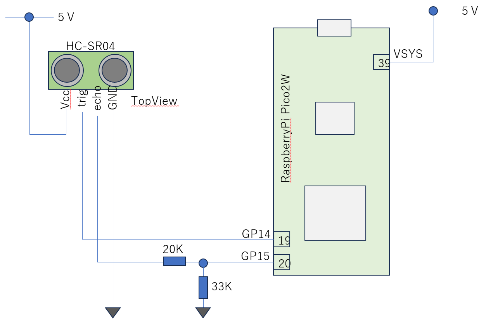

# 距離センサ(HC-SR04)の利用

距離を測るセンサはいろいろな種類があります。安価でよく使われる距離センサとしてHC-SR04が挙げられます。HC-SR04は超音波を使って対象物との距離を計測します。

距離センサ(HC-SR04)仕様
- Senserion SCD41
- 温度、湿度、CO2濃度
- I2C接続
   - デバイスアドレス： 0x62
   - メモリに割り当てられたレジストをRWするのではなく、センサに制御コマンドを送信して制御する

### 配線図



HC-SR04は計測を指示するTrig(Trigger)信号と、センサから対象物までの距離をパルス幅で表現したEchoで制御されます。
HC-SR04の電源電圧は5Vですので、HC-SR04からの信号をマイコンに直結するのは避けて、抵抗で分圧して電圧を3Vまで下げています。
HC-SR04用のドライバは以下です

file: lib/hc_sr04.py
```
#
# driver for HC-SR04
#  v0.01 2025/2/11
#  v0.02 2025/4/26 refactor to class
#

from  machine import Pin
import time

TEMPERATURE = 24.0    # default 24.0 
SPEED_OF_SOUND = 331.45 + 0.61 * TEMPERATURE   # m / sec

MAX_TRY_COUNT = 65535

class HC_SR04:

    def __init__(self, trigger, echo):

        self._trigger = trigger
        self._echo = echo
        self._trigger.off()

    def measure(self):

        # generate High Pulse (width:10usec)
        self._trigger.on()
        time.sleep_us(10)
        self._trigger.off()
    

        # wait until ECHO H signal
        echo_on = None
        for _ in range(MAX_TRY_COUNT):
           if self._echo.value():
                echo_on = True
                break
        if not echo_on:
            print('internal error, can not find signal; ECHO H')
            return -1
        else:
            start = time.ticks_us()

        # wait until ECHO L signal
        echo_off = None
        for _ in range(MAX_TRY_COUNT):
            if not self._echo.value():
                echo_off = True
                break

        # measure time of Level H and calcurate distance
        if not echo_off:
            print('internal error, can not find signal; ECHO L')
            return -1
        else:
            pulse_width = time.ticks_diff(time.ticks_us(),start)
            distance = SPEED_OF_SOUND * pulse_width * 100  / ( 1000 * 1000) / 2 
            return (distance, pulse_width)

```
上記ドライバのテストプログラムは以下です
```
import time
from machine import Pin
from hc_sr04 import HC_SR04

trig = Pin(14, Pin.OUT)
echo = Pin(15, Pin.IN)
hc_sr04 = HC_SR04(trig,echo)

while True:
  distance, pulse_width = hc_sr04.measure()   # 
  #print(pulse_width)

  report = f"dist: {distance:0.2f} cm\npulse: {pulse_width} usec"
  print("-------------------")
  print(report)
  time.sleep(1)

# end of file
```

上記ドライバのテストプログラムは以下です (LCD ディスプレイにも対応した版
```
import time
from machine import Pin
from hc_sr04 import HC_SR04

LCD_AVAILABLE = True
trig = Pin(14, Pin.OUT)
echo = Pin(15, Pin.IN)
hc_sr04 = HC_SR04(trig,echo)

if LCD_AVAILABLE:
   from st7032 import ST7032LCD
   from machine import I2C
   i2c = I2C(1, scl=Pin(19), sda=Pin(18), freq=10000) # OK??
   lcd =  ST7032LCD(i2c)

while True:
  distance, pulse_width = hc_sr04.measure()   # 
  #print(pulse_width)

  report = f"dist: {distance:0.2f} cm\npulse: {pulse_width} usec"
  print("-------------------")
  print(report)
  if LCD_AVAILABLE:
     lcd.print(report, cls=True)
  time.sleep(1)

# end of file
```


### 参考資料
- Sensirion SDC41 Porcut
  - https://sensirion.com/jp/products/catalog/SCD41
- Sensirion SCD4x DataSheet
  - https://sensirion.com/media/documents/48C4B7FB/67FE0194/CD_DS_SCD4x_Datasheet_D1.pdf
- Sensirion Drvier
  - https://github.com/Sensirion/python-i2c-scd/tree/master/sensirion_i2c_scd/scd4x
