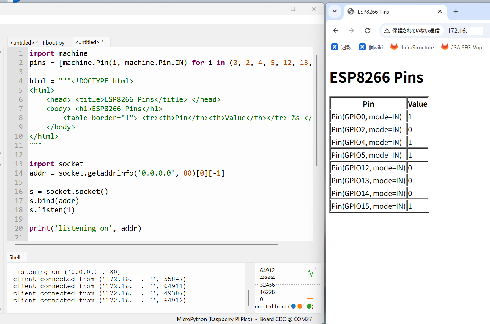
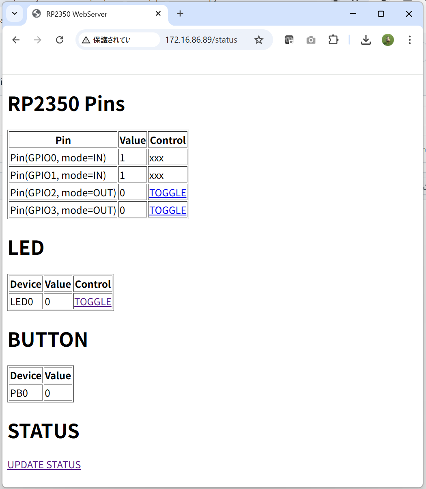

# RP2をWebServerとして動かす

MicroPythonにはSocketモジュールが存在しており、RP2をWebServerとして稼働させることができます。以下は簡単なWebServerの例です。
80番ポートでTCPソケットをListenしています。Webブラウザから、RP2のIPに対して、http://192.168.10.100:80 等のURLでアクセスすることで、RP2はTCPのセッションを確立させ、GPIO Pinの状態を取得してHTMLを作成し、Webブラウザに返却します。

https://docs.micropython.org/en/latest/esp8266/tutorial/network_tcp.html#simple-http-server

```
import machine
pins = [machine.Pin(i, machine.Pin.IN) for i in (0, 2, 4, 5, 12, 13, 14, 15)]

html = """<!DOCTYPE html>
<html>
    <head> <title>ESP8266 Pins</title> </head>
    <body> <h1>ESP8266 Pins</h1>
        <table border="1"> <tr><th>Pin</th><th>Value</th></tr> %s </table>
    </body>
</html>
"""

import socket
addr = socket.getaddrinfo('0.0.0.0', 80)[0][-1]

s = socket.socket()
s.bind(addr)
s.listen(1)

print('listening on', addr)

while True:
    cl, addr = s.accept()
    print('client connected from', addr)
    cl_file = cl.makefile('rwb', 0)
    while True:
        line = cl_file.readline()
        if not line or line == b'\r\n':
            break
    rows = ['<tr><td>%s</td><td>%d</td></tr>' % (str(p), p.value()) for p in pins]
    response = html % '\n'.join(rows)
    cl.send('HTTP/1.0 200 OK\r\nContent-type: text/html\r\n\r\n')
    cl.send(response)
    cl.close()
```
実際に動かした画面は以下の通りです<br>


ブラウザで状態を表示するだけではなく、LEDの点灯制御等もできるようにすることも可能です。<br>
下記のソースでは、２種類のURLを実装しており、GPIOの状態表示に加え、On/Off制御も可能です。<br>
<a href="src/web_server/rp2_webserver.py">WebServer ソース</a><br>
<br>

現在RP2にどのIPが割り当てられているか？は以下の操作で確認することができます。ですが、boot.pyでの実装では、staの値は関数内に閉じており、参照できません。すみません。
```
print(sta.ifconfig())
```
boot時にコンソールに表示されますので、それを見てご確認ください。
