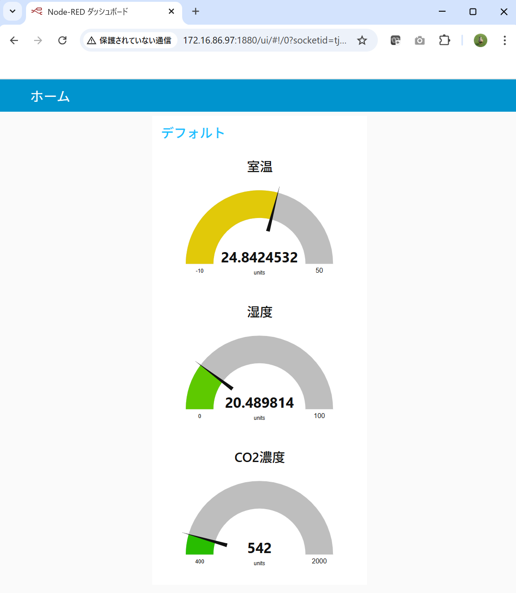

# 空気質収集とIoTダッシュボード表示(その２）

IoT ダッシュボードの作成例として、Raspberry Pi 上でNode-REDを稼働させ、Node-REDのMQTT Client ノードと、グラフ描画ノードを用いることで手軽にIoT ダッシュボードを実現することができます。

MQTT BrokerにPublishされたメッセージをNode-REDを使って見える化します
Node-REDにはグラフ化機能がありそれらを使うことで簡単にダッシュボードを作ることができます。

Node-REDを用いたIoT Dashboard 
 
Node-REDのフロー 
 
 
 
 
 
