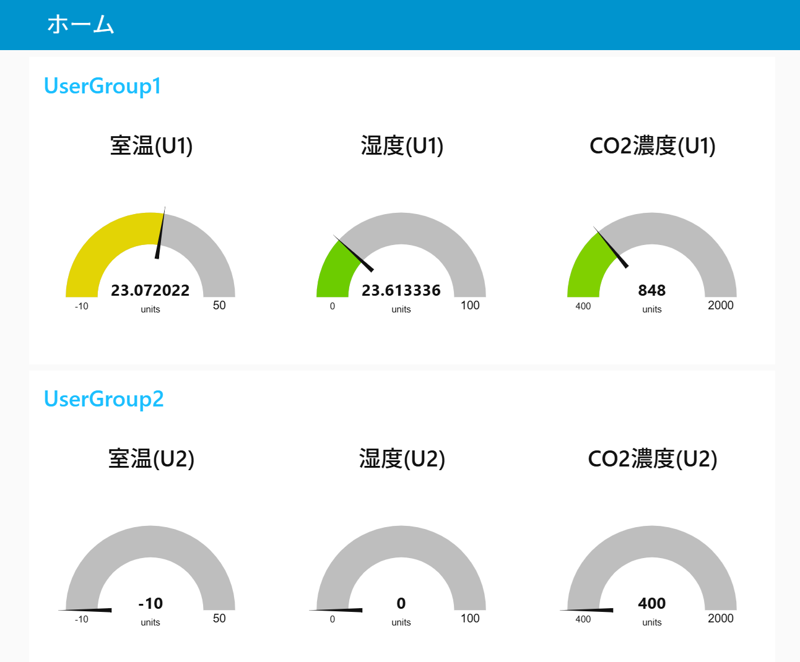
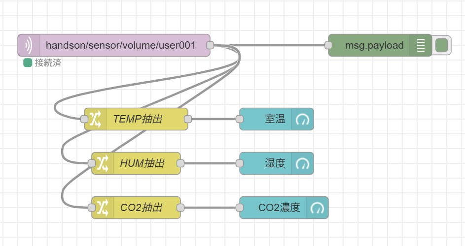
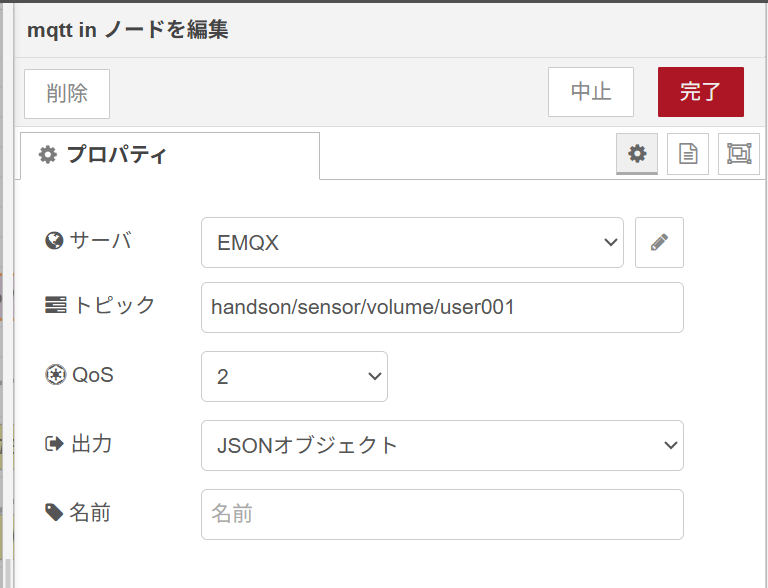
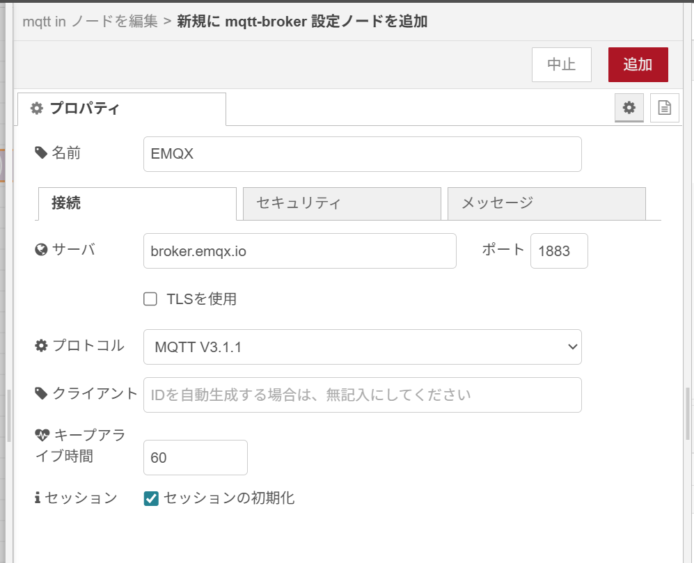
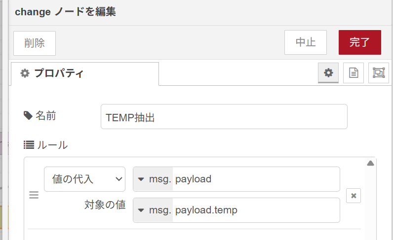
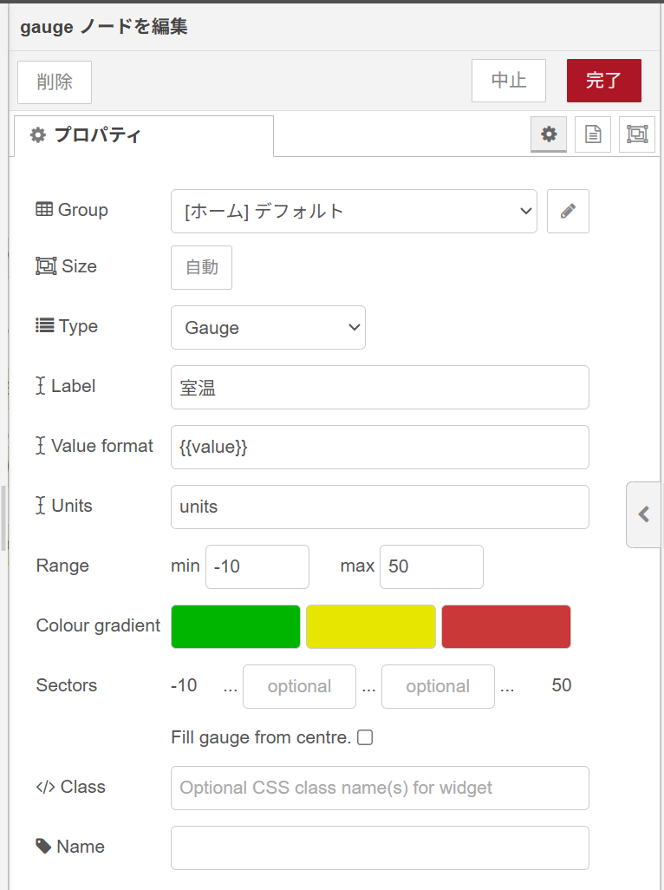

# 空気質収集とIoTダッシュボード表示(その２）

IoT ダッシュボードの作成例として、Raspberry Pi 上でNode-REDを稼働させ、Node-REDのMQTT Client ノードと、グラフ描画ノードを用いることで手軽にIoT ダッシュボードを実現することができます。

MQTT BrokerにPublishされたメッセージをNode-REDを使って見える化します
Node-REDにはグラフ化機能がありそれらを使うことで簡単にダッシュボードを作ることができます。

Node-REDを用いたIoT Dashboard 
 

- Node-REDのフロー 
 

- MQTT メッセージの受信はMQTT INノードを用います。 
MQTT INノードを使うことで、Subscribeが自動的に行われ、条件に合ったメッセージが発行されると、MQTT INノードにデータが送信されます 
 
 

- 送信されたデータは、JSON形式で、温度、湿度、CO2濃度がまとまっていますので、Changeノードを使って、温度だけを取り出します。 
 

- msg.payloadに温度情報を入れて、ゲージノードにメッセージを流します。ゲージノードは上流(Changeノード）から送られてきたメッセージを参照して、ゲージの表示を更新します 
 

Node-REDのソース一式 
[src/Node-RED_flows_3users.json](src/Node-RED_flows_3users.json) 
清書版 
[src/Node-RED_flows_3users_pp.json](src/Node-RED_flows_3users_pp.json)

12/5に導入していただいたRPiのIP 
http://172.16.86.97:1880 
Dashboard にアクセスするURL 
http://172.16.86.97:1880/ui
