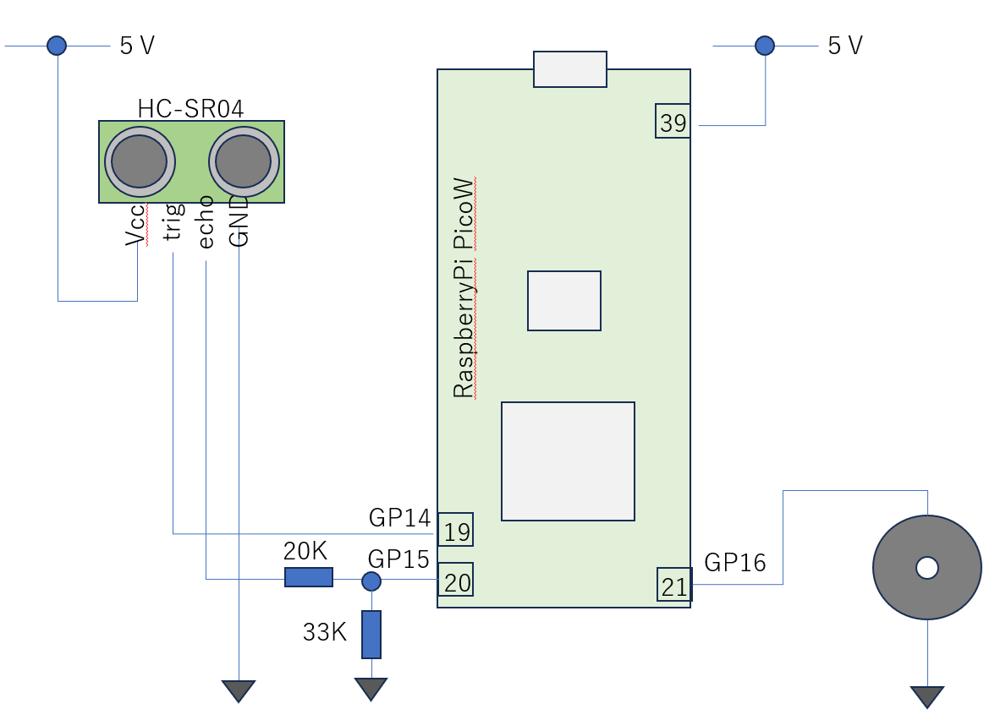
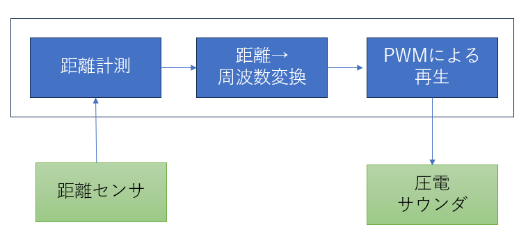

# デジタルテルミン試作

## 概要設計
- アプリ名：デジタルテルミン
- できること：距離センサに手をかざして、手を上下に動かすと、圧電スピーカから再生される音が変わる。楽器として使えるかも

## 機能設計
- ハードウエア構成


- ソフトウエア構成


## ソースコード
```
import time
from machine import Pin
from machine import PWM
from hc_sr04 import HC_SR04


trig = Pin(14, Pin.OUT)
echo = Pin(15, Pin.IN)
hc_sr04 = HC_SR04(trig,echo)

# setup PWM output
PWM_OUT_PIN=16
freq = 440
pwm0 = PWM(Pin(PWM_OUT_PIN), freq=freq, duty_u16=0)

MIN_DIST = 0
MAX_DIST = 30

MIN_HZ = 100
MAX_HZ = 800

VOLUME = 0x1ff

def dist2freq(dist):
    freq = dist / (MAX_DIST-MIN_DIST) * (MAX_HZ - MIN_HZ ) + MIN_HZ
    return freq

while True:
    distance, pulse_width = hc_sr04.measure() 
    print(f"dist: {distance:0.2f} cm", end="")
    if distance > MAX_DIST:
        pwm0.duty_u16(0)
        print()
        time.sleep(0.05)
    else:
        freq = dist2freq(distance)
        pwm0.freq(int(freq))
        pwm0.duty_u16(VOLUME)
        print(f" freq: {freq} Hz")
        time.sleep(0.05)

# finally; disable PWM
pwm0.deinit()

```
